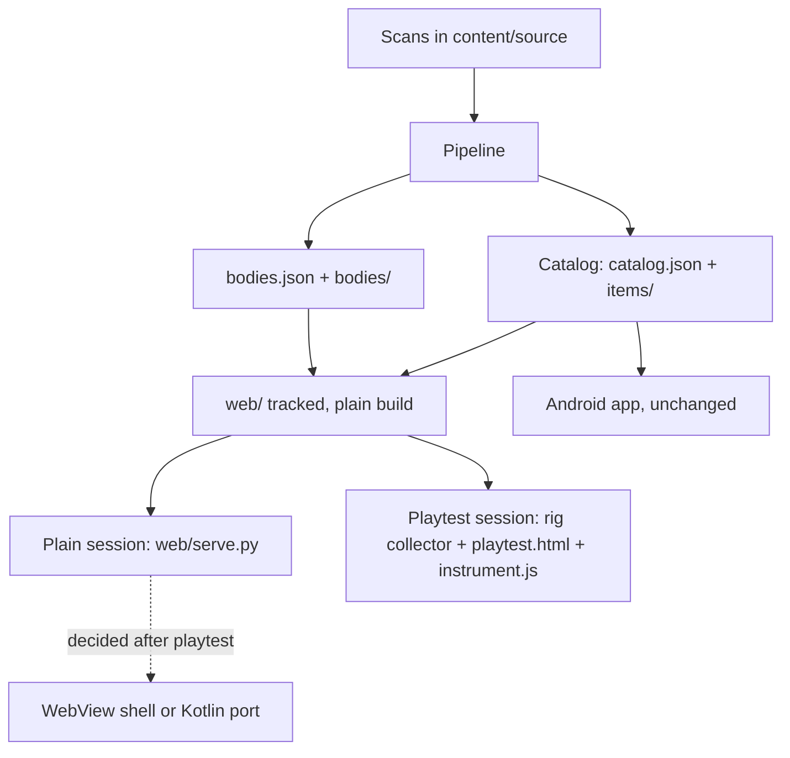
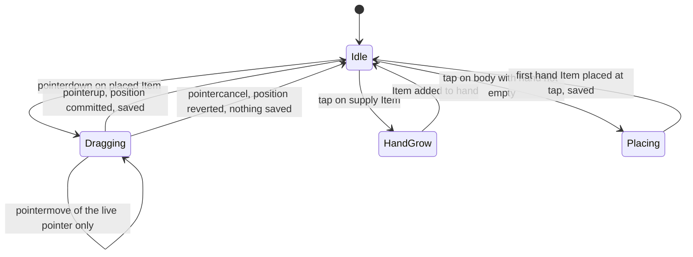

# Playable Web Version - Plan

## Goal Capsule

- **Objective:** The child plays the dress-up game on the tablet without being told what to do, dressing Base Bodies to completion and moving Items between them, and the adult learns from that play what the real app must be.
- **Means:** A versioned web version of the game under `web/`, served from this machine over the home network, running on the pipeline's Catalog and a pipeline-emitted bodies file, with recording available only through a playtest page hosted in the gitignored rig (KTD1, KTD2, KTD3).
- **Product authority:** This document for scope and behavior. `playtest-rig/BOUNDARY.md`, as amended by KTD9, is binding for anything that records the child. `docs/memory/decisions.md` for standing project decisions.
- **Execution profile:** Content units first (U1 to U3), then the web app (U4, U5), then the first content run (U6), then the playtest layer (U7, U8). U7 and U8 edit gitignored files and are verified by the boundary script, not by a commit.
- **Stop conditions:** Stop and ask if the shared scale factor cannot be made to hold across the Fantasy book's bodies and items (KTD4), if the page triage stage cannot reach item-sheet precision comparable to the documented 31/31 on the Fantasy book (KTD5), or if any change would touch Android source under `app/` (R14).
- **Who finishes:** The implementer lands U1 to U6 as commits on `main`. The parent runs U6's content confirmation and U7's boundary check, and performs the first sitting.
- **Open blockers:** None for planning. Content depends on the parent confirming triage verdicts (R7), and a recorded sitting depends on the tablet being on the home network at a pinned address (R9, KTD7).

---

## Product Contract

**Product Contract preservation:** changed: R6 — a name is chosen from a bundled list rather than typed, because the boundary forbids text input anywhere the recorder can see and the recorded page loads the same app; R8 — bodies cannot travel in the Catalog, so R8 now names the pipeline's output directory as the only content source and admits a sibling bodies file; R11 — the boundary document is amended for the home-network address, the game's own save state, and its already-shipped resend queue, all else unchanged; R14 — generated assets under `app/src/main/assets/` change by design, the Android source does not. Added R15 to R18 for behaviors the flow analysis found unstated and the scoping checkpoint confirmed: drop and cancel rules, the hand model, persistence timing, and rotation; and R19 for the completion mark, decided by the user during document review. All other IDs and meaning unchanged.

### Summary

A playable web version of the dress-up game, versioned in this repo, served from this machine to the tablet, and running on the pipeline's real Catalog output so she can page through many Base Bodies with stickers in hand or dress one to completion. Instrumentation is a separate layer the collector adds only for a playtest, keeping the existing privacy boundary and adding a check that a plain build contains none of it. It is built as if it could become the product, and whether the Android app becomes a port of it or a shell around it is decided after she has played it.

### Problem Frame

The playtest rig in `playtest-rig/` put a web version of the dress-up screen on the tablet with full recording, and it failed as a thing to play. She held it, asked what she had to do, asked why dragging did not work, asked why the sizes were wrong, and lost interest. It was built to compare three layouts, with seventeen hand-picked cut-outs and no invitation, and its own boundary document calls it a throwaway for one afternoon. It is gitignored by rule, so it cannot be versioned or shipped, and design tooling cannot work on it.

Meanwhile the Android app has never compiled, there is no Android toolchain on this machine, and every UI change would have to go to the tablet blind. The value she gets from the paper books is known: she stacks a few stickers on her fingers and pages through the mannequins looking for the one they fit, or builds one mannequin up completely, and she stops when the mannequins are done. A paper sticker is spent once placed and cannot move to another body. Reuse, combination across bodies, and novelty are what the digital version adds, and none of that has been in front of her yet.

### Key Decisions

- **Build the web version as if it could become the product, and decide the platform after she has played it** (session-settled: user-directed — chosen over committing now to a WebView shell or to a Kotlin port: she should decide it by playing, not us by guessing). Governs R1, R13, R14.
- **A tracked web app with instrumentation as a detachable layer, not the rig grown into a product** (session-settled: user-directed — chosen over extending the gitignored rig, and over running the first sitting unrecorded: the rig is experiment scaffolding that cannot be versioned or shipped, and the recording layer is worth keeping). Governs R10, R11, R12.
- **Real pipeline content over hand-picked cut-outs.** Paging through Base Bodies needs many of them, and extracting bodies and Items at one scale is the only way to test whether that fixes the sizing she noticed. Governs R6, R7, R8.
- **The invitation comes from the material, not from a game loop.** Undressed Base Bodies in view, a visible supply of Items, and visible completion are what a paper book offers, and she never asks a paper book what to do. Governs R2, R3.
- **Dressed Base Bodies persist between sessions, and taking an Item off to reuse it is the digital-only move** (session-settled: user-approved — proposed over each session starting fresh: the paper book keeps its state, and reuse is the product). Governs R5, R17.
- **Serve on the home network, never on a wildcard address.** The tablet no longer needs Tailscale running, and the collector's refusal to bind everywhere carries over. Governs R9.
- **Carrying is a hand she taps Items into and empties one at a time across bodies, not several fingers dragging at once** (session-settled: user-approved — proposed over concurrent multi-touch drag: a second finger is what silently broke the rig's drag, and the hand can be revisited if it does not read as carrying to her). Governs R3, R16.
- **A released Item stays where it lands, anywhere, and a cancelled gesture snaps back** (session-settled: user-approved — proposed over returning off-body drops to the supply: free placement generalised is the simplest rule and needs no animation she never asked for). Governs R15.
- **A Base Body is complete when she says so** (session-settled: user-approved — proposed over a rule computed from Item categories, and over no mark at all: on paper completion is her judgment, and a rule she disagrees with would be a second thing the game tells her). Governs R2, R19.
- **The three-layout comparison is retired.** The rig's A/B/C question is not this work's question, so there is no layout switching, no counterbalancing, and no per-layout trial semantics.



### Actors

- A1. **The child.** Seven years old, plays on the Galaxy Tab in landscape, touch only. Cannot read instructions and should not need to.
- A2. **The parent.** Starts and stops the server, hands over the tablet, watches, and reads the results afterwards. Runs the boundary check before any recorded session.
- A3. **The collector.** A local process on this machine that serves the web version to the tablet and, in a playtest build only, receives and writes the event log.

### Requirements

**Play**

- R1. The game runs in the tablet's browser in landscape and is playable by touch alone, with nothing to read or configure before play starts.
- R2. Several undressed Base Bodies are in view or one gesture away, the supply of Items is visible, and it is visible when a Base Body is complete.
- R3. Two flows are equally first-class: dressing one Base Body to completion, and picking up several Items and paging across Base Bodies to place each where it fits (F2, F3).
- R4. An Item renders at its true size relative to the Base Body, so a crown and a gown differ in size the way they do on the page.
- R5. A placed Item stays where it is released, can be moved again, and can be taken off and placed on another Base Body, and dressed Base Bodies are still dressed when she comes back another day.
- R6. A Base Body can be given a name chosen from a bundled list of names; nothing else depends on the name, and nothing in the game accepts typed text.
- R15. A release anywhere keeps the Item where it lands, including between bodies and on top of another Item, which then stacks above it; a gesture the browser cancels returns the Item to where it was before the gesture.
- R16. Items are carried in a hand: a tap on a supply Item adds it to the hand, a tap on a body while the hand holds Items places the first of them there, and the hand survives paging between bodies. Only one finger gesture is live at a time; a second finger is ignored until the first lifts.
- R17. Placement state is saved on every committed placement, move, or removal, never mid-drag, and a fresh or cleared tablet starts with every Base Body undressed.
- R18. If the tablet is turned to portrait, the game shows a turn-me-sideways prompt instead of reflowing; there is no portrait layout.
- R19. Each Base Body carries a large star she taps to mark it done and taps again to unmark; nothing computes completion for her, and the mark persists with the placements.

**Content**

- R7. Base Bodies and Items come from the real scans through the pipeline, at one common extraction scale, with a human confirming every page the classifier rejects.
- R8. The web version reads only what the pipeline writes into the app's assets directory: the Catalog for Items and a sibling bodies file for Base Bodies. No hand-authored content path exists for the web version.

**Serving**

- R9. The parent starts the server by hand on this machine, and it serves on the machine's home network address only, never a wildcard bind, with no internet egress and nothing installed on the tablet.

**Recording**

- R10. Recording is a layer present only in a playtest build. A plain build contains none of it, and a tracked check proves that on the plain build's files.
- R11. Any recorded session obeys `playtest-rig/BOUNDARY.md` as amended by KTD9: closed key allowlist, no gesture trails, nothing identifying, the child told, stop honoured, data deleted afterwards, the home-network address in place of the Tailscale one, and the game's save state permitted on the tablet but never read by the recorder.
- R12. The recorded data can answer, for one session, whether she started without asking, whether drag or sizing failed her, how she moved Items between Base Bodies, and where she stopped.

**Posture**

- R13. Play does not depend on the collector: with the recording layer absent, the web version is static files and client-side state, so it could later be bundled offline with no permissions.
- R14. The Android source under `app/` is left as it is. Nothing from the web version or the recording layer is copied into it. Generated files under `app/src/main/assets/` are pipeline output and change with every content build.

### Key Flows

- F1. First contact
  - **Trigger:** The parent opens the web version on the tablet and hands it over.
  - **Actors:** A1, A2
  - **Steps:** She sees undressed Base Bodies and a supply of Items. She picks an Item up and puts it on a body. No prompt, no instruction.
  - **Outcome:** Play starts without her asking what to do.
  - **Covered by:** R1, R2

- F2. Dress one Base Body to completion
  - **Trigger:** She stays with one Base Body.
  - **Actors:** A1
  - **Steps:** She takes Items from the supply and places them on that body, adjusting and swapping until she is satisfied, then taps the body's star.
  - **Outcome:** One dressed Base Body, marked done by her.
  - **Covered by:** R3, R4, R5, R19

- F3. Carry Items across Base Bodies
  - **Trigger:** She picks up more than one Item before choosing a body.
  - **Actors:** A1
  - **Steps:** She taps Items into the hand, pages through the Base Bodies, taps a body to place the next Item from the hand, and returns to the supply for more.
  - **Outcome:** Items distributed across several bodies in one pass.
  - **Covered by:** R2, R3, R5, R16

- F4. Come back another day
  - **Trigger:** A later session on the same tablet.
  - **Actors:** A1
  - **Steps:** The Base Bodies are as she left them. She undresses one to reuse an Item elsewhere, or starts on an undressed body.
  - **Outcome:** Continuity, and reuse as the natural next move.
  - **Covered by:** R5, R17

- F5. A recorded session
  - **Trigger:** The parent wants a session recorded.
  - **Actors:** A2, A3, A1
  - **Steps:** The parent runs the boundary check and gets a pass, starts the collector with the recording layer, tells her it is remembering, and hands over the tablet. Play proceeds as in F1 to F3. The parent stops the collector, reads the results, and deletes the data.
  - **Outcome:** Answers to R12's questions for that session, and no data left behind.
  - **Covered by:** R9, R10, R11, R12

### Acceptance Examples

- AE1. **Covers R1, R2.**
  - **Given** the tablet is handed over with the web version open,
  - **When** she looks at the screen,
  - **Then** undressed Base Bodies and a supply of Items are visible, and she can start placing without asking what to do.

- AE2. **Covers R4.**
  - **Given** a crown and a gown from the same book,
  - **When** both are placed on the same Base Body,
  - **Then** the crown is small on the head and the gown covers the body, in the proportions of the printed page, not the same width.

- AE3. **Covers R3, R5, R16.**
  - **Given** she has tapped two Items into the hand,
  - **When** she pages to a second Base Body and taps it,
  - **Then** the first Item lands on that body where she tapped, and the second Item is still in the hand.

- AE4. **Covers R5, R17.**
  - **Given** a dressed Base Body from a previous day,
  - **When** she opens the web version again at the same address,
  - **Then** the body is still dressed, and she can take an Item off it and put it on another body.

- AE5. **Covers R10.**
  - **Given** the tracked `web/` directory,
  - **When** the plain-build check runs against it,
  - **Then** it finds no recording fingerprint: no rig marker, no event endpoint, no request that sends data anywhere, and passes. The check is a literal scan, so it proves no fingerprint is present, not that no code could be reconstructed at runtime.

- AE6. **Covers R9.**
  - **Given** the parent starts the server with an explicit home-network address,
  - **When** it binds,
  - **Then** it binds to that address only, and a wildcard address is refused with a message.

- AE7. **Covers R11, R12.**
  - **Given** a recorded session has ended,
  - **When** the parent reads the log,
  - **Then** every key is on the allowlist, no line describes her hands or identity, and the results state whether she started unprompted and where she stopped.

- AE8. **Covers R15.**
  - **Given** she is dragging an Item,
  - **When** the browser cancels the gesture because she rotated the tablet or a second finger overwhelmed it,
  - **Then** the Item is back where it was before the drag, and nothing about the cancelled position is saved.

### Success Criteria

- She plays through at least one Base Body to completion without asking what to do, and does not ask why dragging or sizing is wrong.
- She asks to play it again.
- After one session the parent can say which way the Android decision goes, port or shell, from what she did rather than from guesswork.
- Design and interaction changes can be tried in a desktop browser before they go to the tablet.

### Scope Boundaries

**Deferred for later**

- The Kotlin port and the WebView shell. Both stay possible by R13 and R14, neither is built.
- A layout switching panel, layout counterbalancing, or any comparison of layouts.
- SAM segmentation, and quality review of the full corpus beyond what R7 needs for play.
- Rewards, levels, timers, sound, or any progression mechanic. The paper book has none.

**Outside this product's identity**

- Accounts, sharing, or any feature that needs a network beyond the home network for a playtest.
- Recording in a build she can play unsupervised.

### Deferred to Follow-Up Work

- Unifying the Android characters file with the pipeline's bodies file once the platform decision is made. Until then two body formats coexist and only the web one is generated (KTD3).
- The Fantasy w Boy and Knight books. The triage stage is built to handle them, but the first content run is Fantasy only (KTD11), and the page classifier's known fix order in `docs/CONTENT-STRUCTURE.md` is not this plan's work.
- Concurrent multi-touch dragging, if the hand model does not read as carrying to her (KTD6).
- Stitching recording sessions across a page reload. A reload starts a new unlinkable session by design; the review page says so rather than joining them.

### Dependencies and Assumptions

- Supervised page triage is on the critical path to content. The classifier's accepted Item Sheets are trustworthy, its rejections are not, so a human confirms rejections, and the Base Bodies come from the hand survey. The survey's labels are not in the repo, so the body list is authored by hand once (KTD3).
- No Android toolchain is needed for any of this work. The setup script for the JDK and SDK stays unrun until the platform decision.
- The rig's boundary document, allowlist, and gate script carry over as the authority on recording, amended as KTD9 states. Their network-binding checks have only ever run on a Tailscale address, so they run on the home network address before the first recorded session.
- This machine's home network address is pinned, by a DHCP reservation or a static address, and the tablet reaches the game through a home-screen shortcut to that exact address and port. Chrome keys saved state to the address and port, so a changed address is a forgotten game, and both servers share one port for the same reason (KTD7, KTD8).
- The one-shared-scale claim is untested. The rig used hand-declared sizes, not pipeline output, and the sizing she noticed may have come from that or from the claim itself. KTD4 and U6's stratified check are the test.
- A WebView shell's drag feel on this tablet is unknown until one exists. That risk is accepted as the cost of deciding after play.

### Outstanding Questions

**Deferred to Implementation**

- Whether the home directory on this machine is covered by any backup or sync tool. The boundary forbids log copies in a synced folder, and the new log directory must be excluded from one if it exists; the parent knows, the plan does not.

### Sources and Research

- `playtest-rig/README.md`, `playtest-rig/BOUNDARY.md`, `playtest-rig/EVENTS.md`: the rig, its privacy rules, and its event contract. The folder is gitignored by its own rule C-1, and its fingerprint check C-3 greps the whole repo for the do-not-ship marker.
- `playtest-rig/collector.py`: serves its own directory statically, answers a health endpoint and an events sink, refuses to serve logs, binds to one fixed address by default and refuses wildcard hosts without an explicit override. Its default address is a Tailscale address, which R9 changes.
- `playtest-rig/instrument.js`: installs a global recorder with `start`, `stop`, `event`, `mark`, `setPlaced`, `setDragging`, and `flush`, and classifies taps from the page's `data-rig-region`, `data-rig-stage`, `data-rig-kind`, `data-rig-slot` and `data-rig-doll-art` attributes. It keeps a bounded in-memory resend queue for wifi drops, which the boundary's N-5 rule literally forbids.
- `playtest-rig/prototype.js` lines 430 to 520: a single global gesture record overwritten by any new pointerdown, so a second finger orphans the first drag with no event and no revert. The likeliest cause of "dragging didn't work". The scale constants there are hand-declared per layout.
- `playtest-rig/check_boundary.sh`: locates the rig by an absolute path, hardcodes the Tailscale and home-network addresses, asserts the home-network address refuses to answer (N-1n), forbids browser storage in scanned source (D-4), and scans only the rig directory's source files.
- `tools/dressup_pipeline/catalog.py` `downsample`: fits each image into a 512px box on its own longest edge and never upscales, so relative size across items is not preserved. The mechanism KTD4 replaces.
- `tools/dressup_pipeline/models.py` `CatalogItem` and `app/src/main/kotlin/io/dressup/data/CatalogRepository.kt` `CatalogItemDto`: identical field lists, the two ends of the Catalog contract. The Kotlin reader ignores unknown keys.
- `tools/dressup_pipeline/orientation.py` and `pagetype.py`: tested in isolation and called by no CLI. `extract_pdf.py` segments every page today.
- `docs/CONTENT-STRUCTURE.md`: what the scans contain, per-book classifier accuracy, the classifier fix order, and the note that one Fantasy PDF alone holds about thirteen base bodies.
- `docs/solutions/best-practices/thresholds-tuned-on-one-source-fail-on-the-next.md`: stratify every measurement by book before quoting it. Applies to the shared scale factor as much as to the floating-region threshold.
- `docs/handoffs/dress-up-self-contained-pickup.md` and `docs/handoffs/dress-up-direction-and-playtest-rig.md`: the free-placement decision, the sticker-is-spent insight, the finding that bodies share one template and books print at wear size, and the silent CSP and origin failures the rig hit.
- External: MDN on `touch-action` and `pointercancel`, an open MDN issue on `setPointerCapture` needing `touch-action: none` on the captured element on Chrome for Android, the Chromium note that touch drag and the context menu coexist on Android since Chrome 100, MDN storage quotas and eviction (all-or-nothing per origin; `persist()` needs a secure context, which a plain http LAN address is not), and Playwright for Python's pointer and touch event docs.
- Published design canvas, three directions (Wardrobe, Sticker sheet, Two-up): `https://claude.ai/code/artifact/64f716e1-cd3d-4a5c-92df-fc8f676188bc`.

---

## Planning Contract

### Key Technical Decisions

- KTD1. **Vanilla HTML, CSS and ES-module JavaScript under `web/`, no bundler, no framework, no build step.** The tracked directory is the plain build. Rationale: the strict content policy already forbids inline scripts, a shell later wants static files, and Node exists on this machine but nothing here needs it. Governs R1, R13.
- KTD2. **The recording layer lives in the gitignored rig; the tracked app carries only inert `data-rig-*` annotations.** A playtest build is the rig's own `playtest.html`, which loads `web/`'s stylesheet and modules plus `instrument.js`, served by the collector with `web/` as a second static root. The tracked app never references the instrument, never posts anywhere, and the tracked purity test (KTD10) proves it. (session-settled: user-directed — chosen over a build flag that strips instrumentation from one source tree: a flag can be left on, and the rig's containment rules already assume nothing recording-related is tracked.) Governs R10, R11, R12.
- KTD3. **Base Bodies are pipeline output from a tracked page list, written to `bodies.json` and `bodies/<id>.png` beside `catalog.json`.** The list `tools/base_bodies.json` names PDF basename, page number, and an id, authored once from the hand survey. `characters.json` is untouched. (session-settled: user-approved — proposed over extending the hand-authored characters file: free placement means bodies need no snap points, so nothing about a body needs a human's eye except choosing it.) Governs R7, R8, R14.
- KTD4. **One scale factor for every image in a build, bounded by the old ceiling.** The catalog build computes a single factor as the smaller of two ratios, the target body height over the tallest Base Body and 512px over the largest Item's longest edge, and applies it to every body and Item. No image exceeds the 512px edge the Android memory budget in `CLAUDE.md` was sized against, and relative size is preserved because the factor is shared. The target height, the factor, the source DPI, and a build id are written identically into `bodies.json` and `catalog.json`; the Kotlin reader ignores the extra keys, and the web reader refuses to render when the two build ids disagree rather than drawing a mis-scaled board. A per-book table of body heights and Item sizes is printed at build time so a book whose sizes disagree is visible, per the thresholds learning. Governs R4, R7.
- KTD5. **A page triage stage in front of extraction.** `tools/triage_pages.py` runs orientation and page-type classification per page and writes one manifest per PDF under `content/triage/`, with a contact sheet image per verdict for the parent to check. A confirmation file of overrides is merged in, and `extract_pdf.py` gains a `--triage` option that rotates pages as the manifest says and segments only confirmed Item Sheets. Classification runs in item-sheet-only mode: accepted sheets are trusted, every other verdict is confirmed by hand. Governs R7.
- KTD6. **Pointer engine keyed by pointer id with one live gesture, a hand strip, commit on release, revert on cancel, and no swipe on the body canvas.** Drag state is a map keyed by pointer id; while one gesture is live, other pointerdowns are ignored. `touch-action: none` and pointer capture apply only to placed Items, so the browser never starts a pan there. The supply keeps native panning on its own axis and the pager is a strip of large tappable body thumbnails, never a swipe across the canvas, so a drag and a page turn cannot compete for one surface. A pointerdown on a supply tile, a hand slot, a pager thumbnail or a body opens a tap candidate that commits only on a pointerup within the slop radius and time; movement beyond slop or a pointercancel aborts it with no state change. `overscroll-behavior: none` sits on the root, and the long-press callout, selection and image drag are suppressed in CSS. Only pointerup commits a drag; pointercancel restores the pre-gesture position. Governs R15, R16, R18.
- KTD7. **Placement state in `localStorage` under one versioned key, written on every commit, read defensively.** A few hundred small records fit comfortably. The state holds only item index, body index, position, stacking order, each body's done mark, and the chosen name's index, never free text. Every access is wrapped so a throwing or empty store means start fresh, never crash. The store is keyed by the page's origin, so the serving address and port are pinned and the tablet reaches them by shortcut, and both servers use the same port so a playtest session sees what a plain session saved. (session-settled: user-approved — proposed over IndexedDB or a server-side save: no server exists in a plain build, and the data is tiny.) Governs R5, R17.
- KTD8. **A tracked static server `web/serve.py` on the standard library, explicit address required, one shared port.** It refuses wildcard addresses, serves `web/` and the assets directory read-only, sends the same content policy header the collector sends, and prints the exact URL to open. It and the collector use the same port constant and each refuses to start while the other holds it, so the tablet's saved state has one origin. The collector, not this server, serves playtest builds. Governs R9, R13.
- KTD9. **The boundary document and its script are amended, not replaced.** The amendments, in the order the document lists its rules: D-2 holds across both roots, which is why R6 picks a name instead of typing one. D-4 keeps its rule that rig source uses no browser storage API at all, enumeration included, and gains a carve-out for `web/` only: one named key, holding only the fields KTD7 lists. Section 1.2's closed id patterns are replaced by integer indices into the served catalog and bodies lists, so no content id string enters the log. Section 1.3's un-linkability claim is scoped to the event log, since the tablet's game state now carries across sessions by design. N-1 takes the address to check from an argument rather than a literal. N-1n is withdrawn, because serving on the home network makes reachability from that network the intended posture under R9, and the document says so plainly: other devices on the home network can fetch the game. What limits them is that the collector serves nothing but the game, never serves or lists logs, and binds each log to one page load through a random per-session token embedded in the served playtest page. The token rejects events from any other page instance, a stale tab or an earlier session, and is not a secret against other devices on the network. It travels as a query parameter on the root-relative events path the playtest page hands the instrument, so the page-hide flush through the beacon path carries it too, and the collector compares it from the request path and writes neither the request line nor the token. C-3 drops its port pattern, since the tracked server shares the port by design, and keeps the marker, the Tailscale address, the events sink name and the permission string; the events path itself is covered by the tracked purity test. N-5 is rewritten to describe the bounded in-memory resend queue the instrument already has. The source scans for D-2, D-3, D-4 and N-3 extend to the directory served as `web/`. R-1 names the log directory as `~/dress-up-playtest-logs/`, outside the repo, mode 0700, and asserts it. R-4's deletion rule extends to clearing the game's site data on the tablet when she asks for deletion. (session-settled: user-approved — proposed over carrying the document unchanged: two confirmed requirements already contradict it.) Governs R11.
- KTD10. **Tests in pytest, browser tests through Playwright for Python against the real server.** A `browser` marker separates them. Drag is driven with Playwright's mouse, which emits real pointer events; multi-pointer cases use dispatched events with distinct pointer ids. Pages load through `serve.py`, never from a file URL, so the content policy is exercised. A tracked purity test scans `web/` for recording fingerprints with no browser needed: the rig marker, the events path, any POST, beacon or socket, and any absolute or off-origin URL. Same-origin relative fetches of the app's own content are allowed, since R8 needs them. Governs R10, R13.
- KTD11. **The Fantasy book is the first and only content run in this plan.** The classifier is trustworthy there, one of its PDFs holds about thirteen bodies, and the other books are handled by the same stage later. Governs R7.
- KTD12. **Generated assets are untracked.** `catalog.json`, `bodies.json`, `items/` and `bodies/` under `app/src/main/assets/` are all gitignored, the tracked placeholder catalog is removed from the index, and the assets README says the pipeline produces them. A tracked catalog that names ignored images is incoherent on a fresh clone. Governs R8, R14.
- KTD13. **Every recorded event comes from the instrument observing annotations; the app calls nothing.** The rig's page used to emit its own placement, drag and cancel events through the instrument's API and flag drags by hand, so the instrument alone only classifies taps today. That page-side contract is retired: `instrument.js` becomes its own observer of the one live pointer from its document-level listeners, which captured pointer events still reach. It derives a drag from a pointerdown on a placed Item followed by movement beyond slop and a pointerup, aggregating pointermove into the existing integer summaries and never a trail; a cancelled drag from a pointercancel in that state; a hand add, a hand place and a page turn from taps on the new hand, body and pager kinds; and an off-body release by hit-testing the release point against the body annotations. `web/` gains only the `data-rig-kind` values for hand tiles, hand slots and pager thumbnails, inert in a plain build, and every `data-rig-*` value the app carries is an enumerated kind or an integer index, never a content string. New keys join the allowlist and new names the event enum before any code emits them, and the instrument's own hard-coded copies of both lists are updated in the same step, since it silently drops what they do not list. Governs R10, R12.

### High-Level Technical Design

Serving and the two builds:

```mermaid
flowchart TB
  subgraph tracked
    W[web/ index.html, css, js modules, serve.py]
    A[app/src/main/assets: catalog.json, items/, bodies.json, bodies/]
  end
  subgraph rig, gitignored
    PH[playtest.html]
    IJ[instrument.js]
    CO[collector.py]
    CB[check_boundary.sh]
  end
  W --> PS[Plain session: serve.py --host addr]
  A --> PS
  W --> CO
  A --> CO
  PH --> CO
  IJ --> CO
  CO --> TS[Playtest session on the tablet]
  CB -. scans .-> W
  CB -. scans .-> PH
```

Gesture and hand state, one live pointer at a time:



Directional only: a second pointerdown while Dragging or Placing is ignored, not queued.

### Output Structure

```text
web/
  index.html          plain entry, no script inline
  css/game.css
  js/main.js          boot: load catalog + bodies, build screen
  js/catalog.js       read catalog.json and bodies.json, resolve image paths and scale
  js/gesture.js       pointer engine (KTD6)
  js/hand.js          the hand strip
  js/store.js         localStorage persistence (KTD7)
  serve.py            static server (KTD8)
tools/
  triage_pages.py     triage CLI (KTD5)
  base_bodies.json    hand-kept body page list (KTD3)
  dressup_pipeline/triage.py
  dressup_pipeline/bodies.py
  tests/test_triage.py
  tests/test_bodies.py
  tests/test_catalog_scale.py
  tests/web/test_plain_build_purity.py
  tests/web/test_gesture.py     browser
  tests/web/test_persistence.py browser
  tests/web/test_serve.py
content/triage/       manifests and contact sheets, gitignored via content/*
playtest-rig/         gitignored: playtest.html, collector --web-dir, amended BOUNDARY.md, EVENTS.md, check_boundary.sh, review.js
```

### System-Wide Impact

- **The shared assets directory gains a second reader and two generated files.** The Android reader ignores unknown keys, so the scale block and build id added to `catalog.json` do not affect it, and `bodies.json` is invisible to it. Untracking the generated files (KTD12) means a fresh clone has no catalog until the pipeline runs; the assets README carries that.
- **The Android memory budget stays true by construction.** KTD4's factor never lets an image exceed a 512px edge, so the arithmetic in `CLAUDE.md`'s memory constraint holds unchanged, and the note that the bitmap cache needs a cap remains future Android work, not this plan's.
- **Two body formats coexist.** The pipeline's bodies file and the hand-authored Android characters file describe the same things differently until the platform decision; only the web reads the former, only Android the latter. Deferred to Follow-Up Work names the unification.
- **The two files can disagree.** A partial rerun can leave `bodies.json` and `catalog.json` from different builds; the shared build id and the web reader's refusal (KTD4) turn that into a visible failure rather than a mis-scaled board. A body list naming a missing PDF, or an Item group with no body, fails at build time with the name in the message (U2).
- **One origin across both servers.** Saved state, the content policy, and the recorder's same-origin posting all depend on the tablet reaching the same address and port in plain and playtest sessions (KTD7, KTD8). A different port would silently split her saved game in two.
- **The pipeline command lines change.** `CLAUDE.md`'s command block gains the triage step and loses the per-image size flag (U1, U3), and `content/README.md` gains the triage directory (U1).
- **The boundary gives up one guarantee and gains a weaker, honest one.** Tailscale-only reachability is withdrawn; any device on the home network can fetch the game during a session. The per-session token binds each log to one page load and nothing more. Text entry stays structurally impossible across both roots; browser storage is allowed in the app only, under one enumerated key (KTD9).
- **The Item ceiling caps on-screen sharpness.** Keeping images at or under a 512px edge for the Android budget means the web version draws them upscaled on the tablet's high-density screen. Accepted for now; raising the ceiling is a one-number change in the build once the platform decision is made (KTD4).

### Engineering posture

Every module boundary in this plan is there for a reason it can name, and nothing is added for its own sake. The seams that earn their place: the segmenter protocol and the triage stage, because segmentation may be swapped for SAM later (KTD5); the catalog and bodies files, because two apps read one contract (KTD3, KTD4); the gesture engine, hand and store as separate modules, because each is testable without a device and the store's technology may change under a shell (KTD6, KTD7); the recording layer outside the app entirely, because privacy needs a boundary a scan can prove (KTD2, KTD13). An implementer who finds a single-consumer abstraction with no such reason removes it rather than keeping it, and one who needs a new seam names the principle before cutting it.

### Assumptions

- The instrument, not the page, owns drag and placement semantics after U7 (KTD13). If the instrument's classification needs a page structure the app does not have, U7 adapts the app's annotations, never its behavior.
- Every sidecar records the DPI it was rendered at (U1), the bodies stage renders at that DPI and refuses a set of sidecars that disagree (U2), so bodies and Items enter the catalog build at one physical scale before the shared factor is applied.

---

## Implementation Units

### U1. Page triage stage in front of extraction

- **Goal:** Orientation and page-type classification become a runnable pipeline stage whose verdicts a human can confirm, and extraction honours them.
- **Requirements:** R7; KTD5, KTD11.
- **Dependencies:** none.
- **Files:** `tools/dressup_pipeline/triage.py` (new), `tools/triage_pages.py` (new), `tools/dressup_pipeline/extract.py` and `tools/extract_pdf.py` (modify: `--triage` manifest input, rotation before segmentation, skip non-item-sheet pages), `tools/tests/test_triage.py` (new), `tools/tests/test_extract.py` (extend), `docs/CONTENT-STRUCTURE.md` (note the stage exists), `content/README.md` (add the triage directory), `CLAUDE.md` (add the triage step to the pipeline command block).
- **Approach:**
  1. Per PDF, render each page, call the orientation module for the rotation and the page-type module for the verdict, and write a manifest under `content/triage/<pdf-stem>.json` with page number, rotation, verdict, confidence, and a `confirmed` field that starts empty.
  2. Render a contact sheet per verdict class so the parent can scan rejections at a glance, and accept an overrides file that sets `confirmed` per page.
  3. In the extractor, when `--triage` is given, load the manifest, apply rotation, and segment only pages whose confirmed or accepted verdict is Item Sheet. Without the flag, behaviour is unchanged.
  4. The extractor writes the render DPI into every sidecar it creates, a new field under the sidecar rule, so later stages can check that everything shares one physical scale.
- **Patterns to follow:** the sidecar rule in `CLAUDE.md`, stages only add fields; the page-size-in-sidecar rule, so the extractor records the rotated page dimensions; the CLI shape of `tools/extract_pdf.py`.
- **Test scenarios:**
  - A synthetic PDF from `tools/make_smoke_pdf.py` produces a manifest with one entry per page and empty confirmations.
  - A manifest marking a page as rotated 90 degrees leads the extractor to record the rotated page width and height in the sidecar.
  - A page whose verdict is Illustration Plate and unconfirmed is skipped by the extractor, and a page confirmed as Item Sheet by override is segmented.
  - Running the extractor without `--triage` on the same PDF produces the same sidecars as before the change, plus the DPI field.
  - A sidecar written by the extractor records the DPI it was run with.
  - An overrides file naming a page that does not exist fails loudly with the page number in the message.
- **Verification:** the pipeline test suite passes, and running the stage over the smoke PDF yields a manifest, a contact sheet, and sidecars only for confirmed item pages.

### U2. Base Bodies as pipeline output

- **Goal:** The pipeline cuts Base Bodies out of the pages named in a tracked list and writes them beside the Catalog with their pixel heights.
- **Requirements:** R7, R8, R14; KTD3.
- **Dependencies:** U1 for rotation.
- **Files:** `tools/base_bodies.json` (new, hand-authored list: id, pdf basename, page, optional region ordinal), `tools/dressup_pipeline/bodies.py` (new), `tools/dressup_pipeline/catalog.py` (modify: write `bodies.json` and `bodies/<id>.png`), `tools/build_catalog.py` (modify: `--bodies` list input), `tools/tests/test_bodies.py` (new), `tools/tests/test_catalog.py` (extend).
- **Approach:**
  1. For each listed page, read the DPI from the sidecars beside which the bodies are built and refuse to run when those sidecars disagree, render at that DPI, apply the triage rotation, and cut the body with the local-contrast segmentation the orientation module already uses to find figures on decorated backgrounds, since a plain luminance threshold welds a doll into a colour wash. Take the largest region as the body unless the entry names a region ordinal, and fail, naming the entry, when a second region within four fifths of the largest one's height exists and no ordinal is given, because a two-doll page would otherwise lose a doll silently.
  2. Write `bodies.json` as a list of id, image path, width, height, and source PDF, plus the scale block and build id U3 fills in. Body ids are stable strings from the list, not sequence numbers.
  3. Fail the build, naming the entry, when a listed PDF is absent from `content/source/` or when an Item group has no body in the list.
  4. Leave `characters.json` untouched.
- **Patterns to follow:** `CatalogItem.to_dict` for the serialised shape; `downsample`'s RGBA handling for the PNG write.
- **Test scenarios:**
  - A synthetic page with one doll figure yields one body PNG whose bounding box matches the figure.
  - A list entry pointing at a page with no floating region fails with the id and page in the message rather than writing an empty image.
  - A list entry naming a PDF that does not exist fails with the PDF name in the message.
  - A synthetic page with two doll figures of similar height fails without a region ordinal and yields the named figure with one.
  - Sidecars recorded at two different DPIs make the bodies stage refuse, naming the odd one.
  - Two bodies from different PDFs get distinct ids and both appear in `bodies.json` in list order.
  - `catalog.json` written in the same run keeps every key it had before the change.
- **Verification:** the test suite passes, and a build against the smoke PDF writes `bodies.json` and one PNG per listed body.

### U3. One scale factor for bodies and Items

- **Goal:** Every image the catalog build writes is scaled by one factor, so relative size on screen matches the printed page.
- **Requirements:** R4, R7; KTD4.
- **Dependencies:** U2.
- **Files:** `tools/dressup_pipeline/catalog.py` (modify: replace per-image fit with a shared bounded factor, record it in both files with a build id), `tools/build_catalog.py` (modify: `--body-height` target replaces `--max-px`), `tools/tests/test_catalog_scale.py` (new), `tools/tests/test_catalog.py` (extend), `CLAUDE.md` (modify: pipeline command lines and a sentence under the memory constraint saying the 512px edge is enforced by the build), `.gitignore` and `app/src/main/assets/README.md` (modify per KTD12: untrack the generated catalog, ignore all generated assets, document that the pipeline produces them).
- **Approach:**
  1. Compute the factor as the smaller of the target body height over the tallest body and 512px over the largest Item's longest edge, and apply it to every body and Item. Upscaling stays forbidden: a factor above one is clamped to one and the build says so. The default target is 1000px; with the books' proportions the Item ceiling usually decides, and the build says which bound chose the factor.
  2. Write the target height, the factor, the DPI read from the sidecars, and a build id into both `bodies.json` and `catalog.json`.
  3. Print a table of body heights and the median Item height per source PDF within each book, so one PDF scanned at a different setting is visible at build time rather than hidden inside a book median.
  4. Remove the placeholder catalog from the index and ignore the four generated paths.
- **Patterns to follow:** the thresholds learning in `docs/solutions/best-practices/`, stratify by book before trusting a number.
- **Test scenarios:**
  - A body of 1200px and an Item of 300px, with a target height of 600px, come out at 600px and 150px.
  - Two Items of 900px and 200px both scale by the same factor, so the small one is no longer left at full size while the large one shrinks.
  - A body of 1000px and an Item of 1000px with a target height of 900px come out at 512px each, because the Item ceiling wins.
  - A target height above the tallest body clamps the factor to one and reports it.
  - The catalog's `width` and `height` fields match the written PNG dimensions after scaling.
  - `catalog.json` and `bodies.json` from one build carry the same build id and scale block.
  - The build's table names the bound that chose the factor, target or ceiling.
- **Verification:** the test suite passes, the build's per-PDF table for the smoke PDF shows one factor applied throughout, and `git status` shows the generated assets as ignored.

### U4. Web shell, screen, and serving

- **Goal:** The tablet shows undressed bodies, a supply, and an empty hand, loaded from pipeline output, served from this machine at an explicit address, under the strict content policy.
- **Requirements:** R1, R2, R6, R8, R9, R13, R18; KTD1, KTD8, KTD10.
- **Dependencies:** U3 for the bodies file's shape; can start against a hand-made fixture of that shape.
- **Files:** `web/index.html`, `web/css/game.css`, `web/js/main.js`, `web/js/catalog.js`, `web/serve.py` (all new), `tools/pyproject.toml` (modify: add Playwright to dev dependencies), `tools/tests/web/test_serve.py`, `tools/tests/web/test_plain_build_purity.py`, `tools/tests/web/conftest.py` (all new), `.gitignore` (no change expected; confirm `web/` is tracked).
- **Approach:**
  1. `serve.py` requires `--host`, refuses the wildcard set the collector refuses, serves `web/` at the root and the assets directory under `assets/` on the shared port, refuses to start if that port is held, sends the collector's content policy header, and prints the URL. It never accepts POST.
  2. `catalog.js` fetches `assets/catalog.json` and `assets/bodies.json` by relative path, checks the two build ids match and shows a plain "content needs rebuilding" message if not, resolves image paths, and exposes bodies, Items, and the scale block.
  3. `main.js` builds the screen: one body large in view with a strip of large tappable thumbnails of the other bodies (KTD6), a supply of Items grouped by Category that pans on its own axis, a hand strip, a large done-star per body she taps and untaps (R19), and a name chooser per body that offers a bundled list and does nothing else. Every tappable target is at least 56 CSS pixels on each side and supply tiles and pager thumbnails at least 96, carrying the touch-target rule the Android app already follows. No text input exists anywhere in the page. A portrait viewport shows the turn-me-sideways prompt.
  4. Elements carry `data-rig-region`, `data-rig-stage`, `data-rig-kind` and `data-rig-slot` attributes as the instrument documents them, plus the hand and pager kinds KTD13 adds, with enumerated kinds and integer indices as the only values, and nothing else about recording.
  5. The purity test scans the browser-delivered files, `index.html`, `css/` and `js/`, for the rig marker, the word `instrument`, the events path, any POST, `sendBeacon` or socket use, any absolute or off-origin URL, and any text input element. Same-origin relative fetches of the app's own content are allowed. The server's own refusal of POST is proved by the serve test, not by the scan.
- **Execution note:** this unit is mostly shell and packaging; prove it by serving and loading through Playwright before writing unit-level tests.
- **Patterns to follow:** `playtest-rig/collector.py` for the content policy header and wildcard refusal; `playtest-rig/prototype.html` for the CSS that suppresses scroll, zoom, callout and selection.
- **Test scenarios:**
  - Starting `serve.py` with a wildcard address exits non-zero with a message naming the refused address.
  - Starting it with the loopback address and fetching the index returns the page with the content policy header present.
  - A POST to any path on the server is refused and nothing is written.
  - A request for a path outside `web/` and the assets directory is refused.
  - The purity test passes on the tracked `web/` and fails on a copy into which the rig marker, a POST, or a text input has been written.
  - Browser: loading the page against a fixture catalog and bodies file shows one body per fixture entry and one supply Item per Item entry.
  - Browser: fixture files with different build ids show the rebuild message and no board.
  - Browser: a viewport narrower than it is tall shows the turn-sideways prompt and hides the game.
- **Verification:** the pipeline and web tests pass, and the page loads on a desktop browser through `serve.py` with the fixture content.

### U5. Placement engine, hand, and persistence

- **Goal:** She can drag Items onto bodies, carry several in the hand across bodies, take Items off and reuse them, and find everything where she left it another day.
- **Requirements:** R3, R4, R5, R15, R16, R17; KTD6, KTD7.
- **Dependencies:** U4.
- **Files:** `web/js/gesture.js`, `web/js/hand.js`, `web/js/store.js` (new), `web/js/main.js` (modify: wire engine, hand, store), `web/css/game.css` (modify), `tools/tests/web/test_gesture.py`, `tools/tests/web/test_persistence.py` (new).
- **Approach:**
  1. Gesture state is a map keyed by pointer id. A pointerdown while any gesture is live is ignored. Placed Items carry `touch-action: none` and take pointer capture; the supply and the pager strip keep native panning on their axis, and a pointerdown there opens a tap candidate that aborts silently on slop or cancel (KTD6).
  2. A tap, short and within a slop radius, on a supply Item adds it to the hand; a tap on a pager thumbnail brings that body into view; a tap on the body with a non-empty hand places the first hand Item centred at the tap point; a drag on a placed Item moves it and commits on pointerup at the release point, anywhere on the canvas, with z-order last-on-top.
  3. pointercancel on a drag restores the pre-gesture position and writes nothing.
  4. Items render at their catalog pixel size times the ratio of the body's displayed height to that body's own recorded height in `bodies.json`, so one screen factor applies to body and Items whether or not the Item ceiling chose the build factor; the target height in the scale block is build metadata, not a render input.
  5. `store.js` saves the placement list, each body's done mark, and each body's chosen name index under one versioned key on every commit, holding only the fields KTD7 lists, reads once at boot, and treats a missing, throwing, or unparseable store as fresh.
- **Technical design:** the state diagram in the Planning Contract is the engine; the hand is a list of Item ids the diagram's Placing transition pops from.
- **Patterns to follow:** the rig's tap-versus-drag threshold constants as a starting point; the external guidance on pointer capture and cancel.
- **Test scenarios:**
  - Covers AE3. Browser: tapping two supply Items then a body places the first at the tap point and leaves the second in the hand.
  - Covers AE8. Browser: dispatching pointercancel mid-drag returns the Item to its original position and the store is unchanged.
  - Browser: a second pointerdown with a different pointer id during a drag does not move or orphan the first Item, and the first drag still commits on its own pointerup.
  - Browser: dragging an Item and releasing between two bodies leaves it there; releasing on top of another Item stacks it above.
  - Browser: after a placement, the store contains that placement; after reload at the same address, the Item is rendered where it was.
  - Browser: with the store pre-seeded with invalid JSON, the page loads with every body undressed and no error.
  - Browser: a body of recorded height 512, from a build whose target was 900, displayed at 600px renders a 300px Item at 300 times 600 over 512, not 300 times 600 over 900.
  - Browser: a swipe across the supply scrolls it and adds nothing to the hand; a swipe on the body canvas neither pages nor places.
  - Browser: a tap on a pager thumbnail brings that body into view with the hand unchanged.
  - Browser: choosing a name from the list shows it on the body and it survives reload; nothing else changes, and the store holds the name's index, not its text.
  - Browser: tapping a body's star marks it done, the mark survives reload, and a second tap clears it.
- **Verification:** all browser tests pass through `serve.py`, and a manual desktop session can dress a body, carry two Items to another, undress, and reload with state intact.

### U6. First content run: the Fantasy book

- **Goal:** Real Fantasy bodies and Items are in the assets directory at one scale, confirmed by the parent, so U4 and U5 run on real content.
- **Requirements:** R7, R8; KTD4, KTD5, KTD11.
- **Dependencies:** U1, U2, U3, and U4 and U5 for the browser the visual check runs in.
- **Files:** `tools/base_bodies.json` (populate from the survey and the contact sheets), `content/triage/` manifests and overrides (gitignored), `app/src/main/assets/catalog.json`, `items/`, `bodies.json`, `bodies/` (generated and gitignored per KTD12).
- **Approach:**
  1. Run triage over the Fantasy PDFs, hand the contact sheets of non-item verdicts to the parent, and record confirmations.
  2. Pick bodies from the contact sheets and the one PDF known to hold about thirteen, and write the list.
  3. Extract with `--triage`, classify and QA, and build with a body height target; read the per-book table and look at a crown and a gown on a body in the browser.
- **Test expectation:** none -- operational run; the checks are the build's per-book scale table and a visual check of AE2 in the browser.
- **Verification:** the assets directory holds Fantasy bodies and Items, the build's table shows one factor, and AE2 looks right on a desktop browser.

### U7. Playtest build in the rig and boundary amendments

- **Goal:** A recorded session is possible on the home network with the tracked app, under a boundary document that matches what actually runs.
- **Requirements:** R9, R10, R11, R12; KTD2, KTD9.
- **Dependencies:** U4, U5. Edits gitignored files only; nothing here is committed.
- **Files:** `playtest-rig/playtest.html` (new: loads `web/` css and modules plus `instrument.js`), `playtest-rig/collector.py` (modify: per-path routing across three static roots, rig, `web/` and assets, since the handler serves one directory today; `--host` required rather than a Tailscale literal; the shared port; the per-session token embedded in the served page and checked on every events POST), `playtest-rig/BOUNDARY.md` (modify per KTD9), `playtest-rig/check_boundary.sh` (modify per KTD9: address argument, source scans over the web root, integer-index value domains, log path assertion, token check in place of N-1n), `playtest-rig/EVENTS.md` and `playtest-rig/instrument.js` (modify per KTD13: three new events and their classification, keys in the allowlist and names in the enum first), `playtest-rig/README.md` (modify: home-network address, repo path for the check, the log directory, the reload-versus-state note, clearing the tablet's site data on request).
- **Approach:**
  1. Amend `BOUNDARY.md` first, then the script, then the code, in that order, so the document stays the authority.
  2. `playtest.html` mirrors `web/index.html`'s structure and loads the same modules by relative path from the collector's web root; the instrument and the token are the only additions.
  3. Make the instrument the owner of drag, place and cancel events as KTD13 states, extend its classification to the hand and pager kinds, and emit every event with integer or enumerated fields only, after their keys and names are registered in the boundary document, the events document, and the instrument's own copies of both lists. Retire the page-side calls the old prototype made. `web/` is not edited in this unit.
  4. Route the collector across its three roots, add the token check on the events path's query parameter, and move the log directory default to the named path outside the repo, asserted by the script. The tablet's home-screen shortcut points at the plain index; the playtest page lives at its own path that the parent opens deliberately, so holding the shared port never records by accident.
- **Execution note:** run `check_boundary.sh` after each of the four steps; a fail is the signal to stop, not to patch around.
- **Patterns to follow:** the marker on the first five lines of every rig file (C-2); the allowlist-first rule in `BOUNDARY.md` section 1.1; the collector's existing refusal of wildcard hosts.
- **Test scenarios:**
  - Covers AE6. The collector started with the home-network address binds there and refuses a wildcard, and refuses to start while `serve.py` holds the shared port.
  - Covers AE5. The source scans over the web root pass, and fail when the marker, a text input, or a storage enumeration call is planted in a `web/` file.
  - An events POST without the session token, or with a stale one, is refused and nothing is written; a POST with the token is written and the token appears nowhere in the log.
  - The D-4 check fails if `instrument.js` references any browser storage API, named key or not.
  - A hand-add, hand-place, and page-turn each produce one log line whose keys are all on the allowlist and whose item and body fields are integers.
  - A drag of a placed Item and a cancelled drag on the playtest page each produce exactly one placement line and one cancel line, with no app code calling the instrument; an off-body release is marked as such.
  - A page-hide flush through the beacon path carries the token and is written.
  - A key registered in the boundary document but missing from the instrument's own list is caught by the one-line-per-event test rather than dropped silently.
  - A log directory inside the repo tree fails R-1, and the named directory with mode 0700 passes.
- **Verification:** `check_boundary.sh` prints its pass line with the collector running on the home-network address, and a short recorded desktop session produces a log the review page can open.

### U8. Review page answers for the new flows

- **Goal:** The parent's results page answers R12's four questions from a log of the new page.
- **Requirements:** R12; KTD2.
- **Dependencies:** U7. Gitignored files only.
- **Files:** `playtest-rig/review.js`, `playtest-rig/review.html` (modify), `playtest-rig/README.md` (modify: the reload note).
- **Approach:**
  1. Replace the layout-comparison answers with four: time to first placement without a moderator mark, count of cancelled or orphaned gestures and of Items released off-body, a per-body flow of hand places versus direct drags, and the last active minute before the session ended.
  2. Show the reload note where a session boundary appears.
- **Test scenarios:** fixture logs use the `.ndjson` extension, which the review page already accepts and the boundary's stray-copy check ignores.
  - A fixture log with a placement at second twelve and no help mark reports "started unprompted".
  - A fixture log with two pointercancel lines reports two cancelled gestures.
  - A fixture log with hand places on two bodies reports both bodies in the carry summary.
  - A log ending mid-session reports the last active minute and marks the log partial.
- **Verification:** opening each fixture log in the review page shows the expected four answers.

---

## Verification Contract

| Check | Command | Applies to | Passes when |
|---|---|---|---|
| Pipeline and web unit tests | `cd tools && .venv/bin/python -m pytest` | U1 to U5 | all pass, including the plain-build purity test |
| Browser tests | `cd tools && .venv/bin/python -m pytest -m browser` | U4, U5 | all pass against `serve.py` on loopback |
| Plain serve smoke | `tools/.venv/bin/python web/serve.py --host <home-network-address>` then open the printed URL on the tablet | U4, U6 | bodies and Items render, crown and gown proportioned as on the page |
| Boundary gate | `bash playtest-rig/check_boundary.sh --host <home-network-address>` | U7, U8 | prints its pass line with the collector running |
| Content build table | `tools/.venv/bin/python tools/build_catalog.py --group fantasy --body-height <px>` | U3, U6 | one factor reported, per-book table shows no outlier |

Playwright's Chromium needs the network once for the download and, on Ubuntu, its system libraries, which the install-with-dependencies step needs sudo for; record both in `tools/pyproject.toml`'s dev extra and the CLAUDE.md commands.

---

## Definition of Done

- Global: every row of the Verification Contract passes; `app/` has no source diff, the only index change under it being the untracked placeholder catalog (KTD12); `web/` and the pipeline changes are committed on `main`; the rig changes exist on disk and the boundary gate passes; no abandoned experiment code remains in `web/` or `tools/`.
- U1 done when a triage manifest drives extraction on the smoke PDF and on a Fantasy PDF.
- U2 done when `bodies.json` and body PNGs are produced from the tracked list.
- U3 done when one factor governs every written image and the per-book table prints.
- U4 done when the page loads through `serve.py` on the tablet with fixture or real content and the purity test passes.
- U5 done when the browser tests for hand, drag, cancel, stacking, scale, and persistence pass and a desktop session survives reload.
- U6 done when the parent has confirmed the Fantasy triage and AE2 looks right on real content.
- U7 done when the boundary gate passes on the home-network address with the amended document.
- U8 done when the four answers render from fixture logs.
- Cleanup: the old three-layout `prototype.html` and `prototype.js` in the rig are left in place but unreferenced by the README; nothing from them is copied into `web/`.
