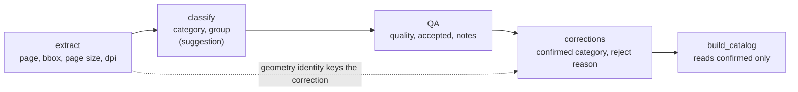
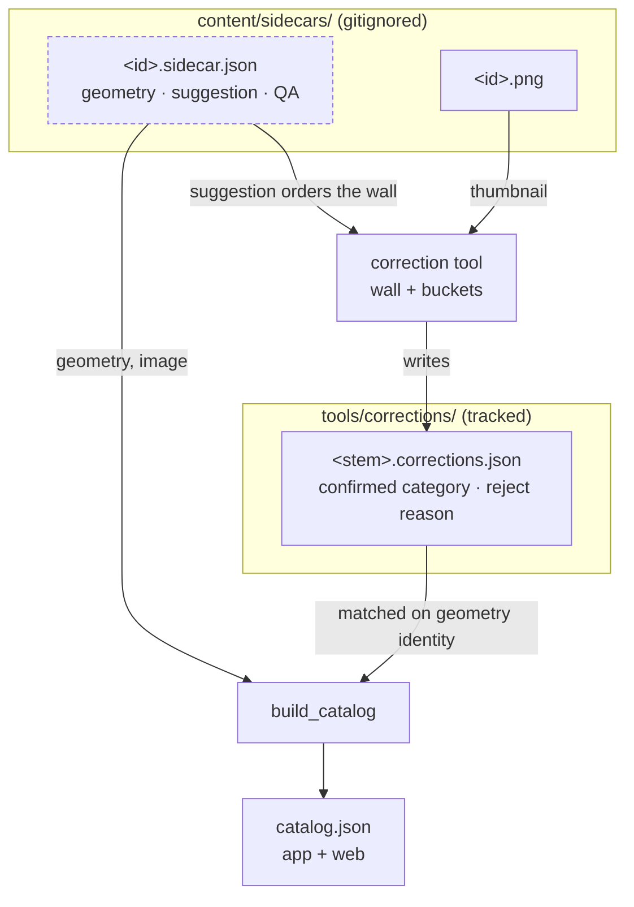

# Catalogue Correction Tool - Plan

## Goal Capsule

- **Objective.** Every item the dress-up game offers sits in the slot a person put it in, and items that are broken or not clothing never reach the child.
- **Means.** A locally served wall where a person files items into category buckets by keystroke, and a build that accepts only what they filed (Key Decisions: human labels are the only labels; the pass is a wall of thumbnails).
- **Product authority.** The Key Decisions below were settled with the user and are not open for re-litigation during planning or implementation. Where implementation evidence contradicts one, stop and raise it rather than resolving it silently.
- **Execution profile.** Python and vanilla-JS work under `tools/`, plus a new local web tool. No Android build and no device session is required to finish or verify this work.
- **Stop conditions.** Stop and ask if implementation shows the correction key cannot distinguish two items anywhere in the corpus, or if making corrections authoritative would require the build to rewrite a field QA or classify owns. Both would break a settled decision.
- **Who finishes it.** An implementing agent or the user working locally; the labelling pass itself is the user's and is not part of this work.
- **Open blockers.** None for planning. One accepted consequence: until the pass is run, the catalogue is empty and the playable web version shows no items (see `docs/handoffs/dress-up-return-with-corrected-catalogue.md`).

---

## Product Contract

**Product Contract preservation:** changed — R14 reworded and R18 added, and a Key Decision added for welded cutouts, after the user settled that a multi-item cutout may be kept as one item rather than always rejected. R1, R11 and R12 were rewritten earlier in the same session when the user settled that a human label overrides QA. All other requirements and every R/AE ID are unchanged.

### Summary

A keyboard-driven tool, served from this machine, that shows all extracted items as one wall of thumbnails, lets a person file them into category buckets or reject them, and records those corrections as the authoritative labels the pipeline honours. The classifier is demoted from deciding categories to merely suggesting them.

### Problem Frame

The classifier assigns a category from geometry alone — an item's aspect ratio, its share of the page, and its vertical centre (`tools/dressup_pipeline/classify.py:63-80`). It documents its own premise: sticker sheets "lay them out roughly by body order, so vertical position on the page carries real signal". For this corpus that premise is false, and three separate failures compound.

The sheets are not ordered by body position. A rendered page shows staffs, crowns, masks, flower garlands and a sash intermixed, alongside several items that are not clothing at all — a robin, two hummingbirds, a fish, two jellyfish, a squirrel, a teddy bear.

The scans are photographs placed on a larger canvas, so roughly the bottom third of every page is blank. No item in the corpus has a vertical centre beyond 0.54 of the page. The `shoes` branch requires a centre beyond 0.80 and `bottom` is the remaining else-branch above 0.55, so neither can ever fire — yet the corpus visibly contains leggings, trousers and boots. Every one of them is currently filed as something else.

Two further categories, `wings` and `mount`, are unreachable for a different reason: no branch returns them at all. Four of the eleven categories that exist today are therefore beyond the classifier's reach — two because of how these particular scans are framed, two because the code has no path to them — and the labels that do get assigned carry no evidence behind them. Neither pair is worth fixing by rewriting the classifier, because the premise underneath it does not hold for this material.

There is no way to correct this today. `classify_sidecar` (`tools/dressup_pipeline/classify.py:105`) sets `category` and `group` unconditionally on every run, so a label typed into a sidecar by hand is erased the next time the stage runs. The only override mechanism in the tree governs page triage, not item categories.

The cost lands on the child: a hat that equips as a torso, or a jellyfish offered as an accessory, breaks play.

### Key Decisions

- **Human labels are the only labels the catalogue accepts.** The classifier keeps writing a suggestion; the build refuses anything a person has not confirmed. Chosen so a mislabeled item is structurally unable to reach the game rather than a matter of diligence. (session-settled: user-approved — chosen over leaving the heuristic authoritative for uncorrected items: four of the eleven existing categories are unreachable by the heuristic, so its output cannot serve as a trustworthy default.) Governs R10, R11, R12.
- **The pass is a wall of thumbnails sorted into buckets.** (session-settled: user-directed — chosen over one-item-at-a-time and a per-category exception sheet: batching plus a wall that visibly empties as the work completes.) Governs R1, R2, R3, R4.
- **v1 labels and rejects; it does not repair crops.** A crop problem is recorded for later machinery to act on. (session-settled: user-directed — chosen over label-and-reject only and over in-browser bounding-box editing: crops matter but mislabeling is the unacceptable defect.) Governs R14, R15.
- **A welded pair is kept when it works as one, and otherwise queued for semantic segmentation.** Parameter re-cutting is not an option for it: `docs/solutions/best-practices/thresholds-tuned-on-one-source-fail-on-the-next.md` records that DPI changes do not separate stickers touching on the paper, because the contact is physical. (session-settled: user-directed — chosen over always queueing multi-item cutouts, and over adding a browser split line: keeping a usable pair costs one keystroke, and the queue's real job is identifying what to point SAM at.) Governs R15, R18.
- **Corrections identify items by extract's geometry identity, not by item id.** Item ids are positional (`<stem>-p{page}-i{index}`, `tools/dressup_pipeline/extract.py:262`), so re-cutting a page renumbers everything after the change. (session-settled: user-approved — chosen over keying by item id and over introducing a content hash: `_carry_over` already defines item identity this way, so this is reuse rather than new machinery.) Governs R8, R9.
- **Corrections are tracked in git.** (session-settled: user-directed — chosen over keeping them machine-local beside the corpus: the labelling is roughly half an hour of judgement that nothing can regenerate, and KTD-15 already cost this project a tree.) Governs R7.
- **The tool is desktop and keyboard-driven, served on loopback.** (session-settled: user-directed — chosen over a tablet-first or responsive build: the pass is a sitting at a desk, and the tablet stays a play device with nothing installed on it.) Governs R2, R16.
- **A human label overrides QA.** The wall carries every extracted item, including the 80 QA rejected, and a label admits an item whatever QA said about it. Chosen because all 80 rejections are for being small, and a hair clip or a ring is legitimately small — the same class of error as the classifier's geometry assumptions. (session-settled: user-directed — chosen over restricting the pass to the 253 QA accepted, and over showing QA's verdict per item for a second decision.) Governs R1, R11, R12.
- **`companion` is added to the category list and `mount` is kept.** The creatures in these books are companions, not mounts; `mount` stays for a rideable that a Dragon book may yet supply. (session-settled: user-directed — chosen over renaming `mount` to `companion`.) Governs R13.

The field-ownership rule that makes the correction stage safe:



Each stage adds fields and never rewrites a field an earlier stage owns (KTD-12). Corrections are a new field owner, so the classifier's suggestion and the human's label coexist rather than overwrite.

### Actors

Single-actor work: one person doing the pass, plus the pipeline stages that read what they produce. No Actors section is warranted.

### Key Flows

- F1. The labelling pass
  - **Trigger:** The person starts the tool and opens it in a desktop browser on this machine.
  - **Steps:** The wall loads with every extracted item as a thumbnail, ordered so items the classifier guessed alike sit together. The person clicks one item or a run of them, presses that category's key, and the selection files into it and leaves the wall. Misjudged items are re-filed. Broken items and non-clothing go to the reject bucket with a reason.
  - **Outcome:** The wall is empty; every item carries a human label or a rejection.
  - **Covered by:** R1, R2, R3, R4, R5, R6, R14

- F2. The pipeline honouring the pass
  - **Trigger:** The catalogue build runs after corrections exist.
  - **Steps:** The classifier stage runs as before, writing its suggestion. The build reads each sidecar together with its correction, matched on geometry identity, and takes the human category. Items with no human label, and human-rejected items, are left out; QA's verdict no longer decides inclusion either way.
  - **Outcome:** `app/src/main/assets/catalog.json` contains only human-labelled items.
  - **Covered by:** R9, R10, R11, R12

### Requirements

**The labelling surface**

- R1. Every extracted item in the corpus appears as a thumbnail on one continuous scrollable wall — including items QA rejected — so the size of the remaining work is visible at a glance.
- R2. Items are selected by pointer and filed into a category by a single keystroke, with a separate keystroke for rejection.
- R3. A filed item leaves the wall, so what remains is exactly what is still unlabelled and the pass is finished when the wall is empty.
- R4. The wall is ordered so that items sharing the classifier's suggestion sit together, so a run of similar items can be filed in one action.
- R5. The pass survives interruption: closing the tool and returning later does not re-present items already filed.
- R6. A filed item can be re-filed from within the tool, so correcting a slip never means editing a file by hand.

**The correction record**

- R7. Corrections are stored per source PDF in files tracked in git, carrying no image data, no absolute paths, and no network address or hostname.
- R8. A correction identifies its item by its source PDF together with the item's geometry — page, bounding box, page dimensions and dpi — rather than by the positional item id.
- R9. A correction that no longer matches any extracted item is kept and reported rather than silently discarded, so a re-extraction cannot quietly lose labelling work.

**The pipeline contract**

- R10. The classify stage continues to write `category` and `group` as a suggestion, and no stage overwrites a human correction, preserving the additive sidecar rule (KTD-12).
- R11. The catalogue build includes exactly those extracted, classified and QA-complete items carrying a human category. QA-complete means QA has run and recorded a verdict, not that the verdict was favourable: a human label admits an item whatever QA decided and whatever it scored. An unlabelled or human-rejected item cannot reach the game.
- R12. QA keeps writing `quality`, `accepted` and `notes`, and nothing overwrites them; they cease to gate the catalogue and become advisory, which the build's own reporting should make visible rather than silent.
- R13. `companion` joins the shared category list in every consumer that carries it, and `mount` remains in the list.

**Crop rejection and the repair queue**

- R14. A rejection records which kind of problem it is — a bad crop, more than one item in the cutout, or not a dress-up item — so later work can act on each kind without re-reviewing the rest.
- R18. A cutout holding more than one item can instead be filed as a single item when it works as one, so a usable pair is not lost waiting for segmentation work.
- R15. This work performs no crop repair: nothing re-cuts a page, edits a bounding box, or changes segmenter parameters. A multi-item rejection is queued as needing semantic segmentation (KTD-16), not a parameter sweep — re-rendering at 100, 150, 200 and 300 DPI is already recorded as failing to separate stickers that touch on the paper.

**Serving posture**

- R16. The tool is served from this machine on an explicitly supplied host that defaults to loopback and refuses a wildcard bind, following the posture of `web/serve.py`.
- R17. The tool accepts writes only for corrections; item images and catalogue data are served read-only.

### Acceptance Examples

- AE1. **Covers R9.** Given a page whose items have been labelled, when that PDF is re-extracted and one cutout's bounding box changes, then the corrections for items whose geometry is unchanged still apply, and the correction for the changed cutout is reported as unmatched rather than dropped.
- AE2. **Covers R11.** Given a corpus where some items have been labelled and some have not, when the catalogue is built, then only the labelled items appear in it and the unlabelled ones are absent without failing the build.
- AE3. **Covers R11, R12.** Given an item QA scored at 0.84 and marked not accepted for being small, when a person files it as `accessory` and the catalogue is built with `--min-quality 0.90`, then the item appears in the catalogue and its QA fields are unchanged on disk.
- AE4. **Covers R10.** Given an item that has been filed as `bottom` by hand, when the classify stage is re-run, then the item's suggestion may change but its human label does not.
- AE5. **Covers R5.** Given a pass interrupted partway, when the tool is reopened, then the wall contains exactly the items not yet filed.
- AE6. **Covers R14.** Given an item rejected as holding more than one item, when the repair queue is read, then that item is distinguishable from an item rejected for not being clothing and from one rejected for a bad crop.
- AE7. **Covers R18.** Given a cutout holding a pair of boots that reads as one item, when a person files it as `shoes`, then it enters the catalogue as a single item and does not appear in the repair queue.

### Scope Boundaries

- Crop repair machinery: re-cutting a page, splitting a welded cutout, or editing a bounding box. v1 records the queue only. The segmenter swap that would actually separate touching stickers (KTD-16) is the work this queue feeds, not part of it.
- The page-triage confirmation still owed by R7 of the web-version plan. Every current manifest carries `confirmed: null`; this tool does not address it.
- Any change to the segmenter, including the SAM swap named in KTD-16.
- The Android app, which is untouched. A companion needs no snap point to be usable: `SnapCalculator.resolve` free-places an item whose category matches no snap point (`app/src/main/kotlin/io/dressup/domain/SnapCalculator.kt:38`), which is arguably the behaviour a shoulder squirrel wants anyway. Whether companions should instead lock to a position is a later decision.
- Improving the heuristic classifier. Its suggestions only seed the wall's ordering; their accuracy no longer affects what ships.

### Dependencies / Assumptions

- The corpus is machine-local and gitignored: 333 sidecars over nine PDF output directories, all in group `fantasy`. All 333 go on the wall (R1); the 253 QA currently accepts is no longer the relevant number, since every one of QA's 80 rejections is for being small. The tool reads what is on disk and does not re-extract.
- Repair must stay scoped to one page at a time. A global re-extraction with different dpi or segmenter parameters would move every bounding box and invalidate the entire pass.
- `app/src/main/assets/characters.json` is a placeholder with guessed snap points and remains the blocking manual step for a playable app. This work does not resolve it.
- Changing the build's acceptance predicate (R11) will fail existing catalogue tests, which construct QA-accepted sidecars with no correction and expect catalogue output — `tools/tests/test_catalog.py` and `tools/tests/test_catalog_scale.py`, plus the shared fixtures in `tools/tests/conftest.py`. That is expected breakage to be updated, not a regression. Adding `companion` (R13) breaks `tools/tests/web/test_content_contract.py`, which parses `CATEGORY_ORDER` out of `catalog.js` and compares it to `models.CATEGORIES`; the shell test does *not* break, because it filters the expected order by the categories present in its fixture.
- Nothing in `tools/` or `web/` currently accepts a write over HTTP. `playtest-rig/collector.py` does, but it is gitignored and is a shape reference only — nothing from it is copied into `app/` or `web/`.
- A newly extracted PDF must be classified and QA'd before its items go on the wall. An item missing either stage is skipped by the build whatever a person filed it as (R11), so labelling it first wastes the judgement.
- The source folders also hold JPGs alongside the PDFs, and `tools/extract_pdf.py` ingests PDFs only. Whether those pages ever reach the wall depends on a JPG-to-PDF step this plan does not cover.

### Outstanding Questions

**Deferred to Planning**

- What a repair-queue entry must carry for later machinery to act on it without a second review pass.
- Whether the wall loads full-resolution cutouts or generates thumbnails, given 333 items and the decoded-bitmap budget that constrains the app.
- How the unmatched-correction report from R9 reaches the person — a file, a tool screen, or a stage warning.

### Sources / Research

- `tools/dressup_pipeline/classify.py:63-80` — the geometry branches, including the unreachable `shoes` and `bottom` cases; `:105` — `classify_sidecar` writing unconditionally.
- `tools/dressup_pipeline/extract.py:148` — `_GEOMETRY`; `:154-192` — `_clear_previous` and `_carry_over`, the existing definition of item identity across a re-extraction; `:262` — the positional item id.
- `tools/dressup_pipeline/triage.py` — `load_overrides` and `effective_verdict`, the repo's precedent for a human verdict standing beside a machine one.
- `tools/dressup_pipeline/models.py:18-29` — the eleven-entry category list, mirrored at `web/js/catalog.js:7-10`, pinned against that mirror by `tools/tests/web/test_content_contract.py`, and documented in `app/src/main/assets/README.md:46`.
- `app/src/main/assets/characters.json:9-18` — snap points for ten categories; neither `mount` nor `companion` has one.
- `web/serve.py:196-227` — required `--host`, wildcard refusal before and after bind, CSP header, 405 on writes.
- `docs/solutions/best-practices/thresholds-tuned-on-one-source-fail-on-the-next.md` — why tuning the heuristic further is the wrong move.
- `docs/handoffs/dress-up-catalogue-correction-service-planning.md` — the request this plan answers, in the user's words.

---

## Planning Contract

### Key Technical Decisions

- KTD1. **Corrections live in `tools/corrections/<pdf-stem>.corrections.json`, one file per source PDF.** `.gitignore:21` ignores `content/*` with only `README.md` negated, so a tracked file cannot sit beside the corpus without a negation inside an ignored tree. `tools/base_bodies.json` is the existing precedent for hand-authored tracked JSON under `tools/`. Instantiates the settled decision governing R7.
- KTD2. **A correction is matched on the source PDF stem plus the five geometry fields** — page, bbox, page size and dpi. The five geometry fields alone are not unique: `20260509081050` and `20260509081623` are scans of the same physical page and share five byte-identical bounding boxes at the same page size and dpi, giving 328 distinct keys over 333 sidecars today. The stem costs nothing because corrections are already partitioned per PDF (KTD1). Note that `_carry_over` (`tools/dressup_pipeline/extract.py:185-190`) looks its predecessor up by `item_id` and only *verifies* those five fields, so the tuple is a sameness check there, not a lookup key — this plan is defining the key, not reusing one. Instantiates the settled decision governing R8, R9.
- KTD3. **Corrections are a separate record, never a field on `Sidecar`.** Keeping them off the sidecar means `classify_sidecar`'s unconditional write (`classify.py:105-115`) needs no carve-out and the additive-stage rule (KTD-12) holds without a new exception. Covers R10.
- KTD4. **`_eligible` gains the correction as an argument and QA's fields stop gating.** It is already the single inclusion predicate (`catalog.py:209-221`) and already reports a distinct skip-reason string per rejection, so new reasons follow the existing counter convention and surface in `BuildSummary.as_report()`. Covers R11, R12.
- KTD5. **The tool is a new server module, not an extension of `web/serve.py`.** That file's posture is that writes are refused and a request body is never read (`serve.py:143-151`); a write endpoint contradicts it directly. The new module copies the host validation, CSP and no-logging posture and diverges only on methods. Covers R16, R17.
- KTD6. **The correction server takes its own port, not `SHARED_PORT`.** 8777 is deliberately shared between the web version and the playtest collector so they cannot co-run, and is pinned at `tools/tests/web/test_serve.py:77`. The correction tool must be usable while the web version serves the tablet.
- KTD7. **The server derives and caches wall thumbnails, and serves the source cutout for one item on demand.** The corpus is 109 MB across 333 items, so the wall cannot load source PNGs; but the decision to put QA's 80 size-rejections back on the wall rests on a person being able to judge a small item, which a fixed thumbnail defeats. Thumbnails for the wall, the original on request for the item being looked at. Resolves the deferred question about how the wall loads images.
- KTD8. **The wall renders a window of one continuous list rather than every thumbnail at once.** Nine of the 18 source PDFs are extracted, so finishing extraction roughly doubles the wall to around 550 items; rendering 333 DOM nodes plus images at once is already wasteful and 550 more so. Windowing rather than discrete pages is deliberate: with numbered pages an empty page would read as a finished pass, breaking the completion signal R3 depends on. Covers R1, R3.
- KTD9. **Existing catalogue tests gain correction fixtures rather than the build gaining a test-only bypass.** A bypass in the inclusion predicate would make the tests prove something the production path does not do. Covers R11.
- KTD10. **Every filing action gets its own key and the page shows the legend.** Twelve categories plus three rejection kinds is fifteen actions against ten digits, so the mapping extends past the number row; a person sorting several hundred items cannot hold an unlabelled mapping in their head. Covers R2.

### High-Level Technical Design

Where each field comes from once corrections exist, and who may write it:



The matcher is the one piece with real edge behaviour:

```
for each sidecar in the corpus:
    key    = (page, bbox, page_width, page_height, dpi)
    record = corrections_for_this_pdf.get(key)
    if record is None            -> not in the catalogue; counted as "no human label"
    if record.rejected           -> not in the catalogue; counted by reject kind
    else                         -> in the catalogue with record.category

corrections whose key matches no sidecar -> reported as unmatched, never discarded
```

Directional: the real loader validates every record before applying any, following `apply_overrides` (`tools/dressup_pipeline/triage.py:84-102`), so a malformed file never leaves the catalogue half-corrected.

### Assumptions

- The person runs the tool on the same machine that holds `content/`. Nothing serves the corpus to another device.
- Item PNGs on disk are the authority for what the wall shows; the tool never re-renders a page or re-runs extraction.
- A correction file is small enough to load whole and to read in a diff — hundreds of records per PDF, no image data.

### Sequencing

U1 is the foundation every other unit reads. U2 and U3 are independent of each other; U3 precedes U5, because the wall's buckets and U1's category validation both read the shared category list. U4 precedes U5 because the client needs endpoints to talk to; U6 reads what U1 and U2 produce. A reviewer can land U1 through U3 as pipeline work before any of the tool exists, and the catalogue stays buildable at every step — it simply produces nothing until corrections are written, which is the intended behaviour, not a broken intermediate state.

### Risks & Dependencies

- **Half the corpus is extracted.** Nine of the 18 source PDFs have sidecars, all of them Fantasy; the remaining nine are eight "Fantasy w Boy" and one Knight. Finishing extraction roughly doubles the wall to around 550 items and, per `docs/solutions/best-practices/thresholds-tuned-on-one-source-fail-on-the-next.md`, will produce proportionally more welded cutouts, because in those two books the cut-outs touch on the paper. KTD8 is the mitigation; the labelling effort itself is not something the tool can reduce.
- **Cross-PDF geometry collisions may grow with extraction.** The five that exist today are between two scans of one physical page, and the unextracted books are repeats of the same title, so the count is worth re-measuring after the next extraction rather than treated as a ceiling. KTD2's key handles them; the risk is assuming five is the maximum.
- **Making corrections authoritative breaks existing tests by design.** `tools/tests/test_catalog.py` builds accepted sidecars with no correction and expects catalogue output, and `tools/tests/test_catalog_scale.py` shares that fixture shape. KTD9 says how these are handled. Adding `companion` separately breaks `tools/tests/web/test_content_contract.py`, which is the test that actually pins the two category lists against each other.
- **The classifier's docstrings assert accuracy claims that demoting it invalidates.** The same learning warns that a retracted measurement outlives its retraction when only one copy is corrected. U3 includes the grep.
- **Playwright browser tests need the existing marker and toolchain.** The tool's client tests follow `tools/tests/web/`'s pattern; if the environment lacks the browser, those tests skip rather than fail the suite, and the pipeline-side tests still prove the contract.

---

## Implementation Units

### U1. Correction record, file format, and geometry matcher

- **Goal.** A pure-Python module that defines one correction, reads and writes a per-PDF correction file, and decides whether a stored correction still applies to a given sidecar.
- **Requirements.** R7, R8, R9, R10, R14, R18.
- **Dependencies.** None.
- **Files.** `tools/dressup_pipeline/corrections.py` (new), `tools/tests/test_corrections.py` (new), `tools/corrections/README.md` (new, explains what the directory is and that it is tracked on purpose).
- **Approach.**
  1. Define a `Correction` dataclass carrying the source PDF stem and the item's geometry (page, bbox, page size, dpi), the confirmed category, and either nothing or a rejection with its kind (bad crop, multi-item, not an item). A kept-as-one welded pair is an ordinary category correction and carries no rejection — per R18 the distinction is whether the person filed it or rejected it.
  2. Give it the `to_dict` / `from_dict` / `write` / `read` round-trip every serializable dataclass in `models.py` has, and a `CorrectionError(ValueError)` mirroring `SidecarError` and `OverrideError`.
  3. Load a file into a mapping keyed by that identity. Keep the on-disk shape a list of records with named fields rather than a composite string key, so the file stays readable in a git diff (Definition of Done); build the lookup key in memory.
  4. Validate every record in a file before returning any of it, following `apply_overrides`, so one malformed record never yields a half-usable set.
  5. Expose the match against a `Sidecar` and an accessor that returns the confirmed category or `None`, named after `effective_verdict`.
- **Patterns to follow.** `tools/dressup_pipeline/triage.py` — `overrides_path`, `load_overrides`, `apply_overrides`, `effective_verdict`. `tools/dressup_pipeline/models.py:116-140` for the round-trip shape. `tools/dressup_pipeline/extract.py:148,185-192` for the geometry tuple and its equality check.
- **Test scenarios.**
  - A correction file round-trips through JSON unchanged, following `test_models.py`'s round-trip test.
  - A correction matches a sidecar from the same PDF with identical page, bbox, page size and dpi.
  - Two sidecars from different PDFs sharing page, bbox, page size and dpi resolve to different corrections — the collision that exists in the corpus today between `20260509081050` and `20260509081623`.
  - Covers AE1. A correction does not match a sidecar whose bbox differs by one pixel, and the loader reports it as unmatched rather than dropping it.
  - A correction whose page size differs does not match, even when page and bbox agree — the case that would silently mis-slot every item on a re-rendered page.
  - A file with one invalid category raises before any record is returned.
  - A file with a rejection kind outside the known set raises.
  - A rejected correction reports itself as rejected and yields no category.
  - Reading a malformed JSON file raises an error naming the path.
  - Reading a file that does not exist yields an empty set rather than raising, so an un-corrected PDF is ordinary.
  - Covers AE4. Re-running the classify stage over a corrected corpus rewrites the sidecars' suggestions and leaves the correction file byte-identical — the structural guarantee KTD3 buys, held as a regression test.
- **Verification.** The pipeline suite passes, and the module can load a hand-written correction file and answer which of a corpus's sidecars it applies to.

### U2. Make corrections authoritative in the catalogue build

- **Goal.** The build includes exactly the items a person labelled, and reports what QA would have excluded instead of silently applying it.
- **Requirements.** R11, R12, R9.
- **Dependencies.** U1.
- **Files.** `tools/dressup_pipeline/catalog.py`, `tools/build_catalog.py`, `tools/tests/test_catalog.py`, `tools/tests/test_catalog_scale.py`, `tools/tests/conftest.py`.
- **Approach.**
  1. Load every file in `tools/corrections/` up front, then match loaded records against the sidecars `_gather` walks and pass the matched correction into `_eligible`. Loading per stem as sidecars are walked would never open the file of a PDF whose sidecars have all disappeared, so a whole book's labelling could go unreported — the opposite of R9.
  2. Replace the `accepted` and `quality` gates with the correction gate: no correction is a skip, a rejection is a skip named by its kind, otherwise the item is eligible and takes the human category.
  3. Keep `is_classified` and `is_qa_complete` as skips — an item the pipeline never finished is still not catalogue material. Both are presence checks (`category`/`group` set, `quality`/`accepted` set), not thresholds, so keeping them gates nothing on QA's verdict (R11).
  4. Add skip-reason strings for the new cases, following the existing string-keyed counter, and add a line to `BuildSummary.as_report()` naming how many items QA would have excluded but a human label admitted. That line is what makes R12's "advisory, not silent" true.
  5. Leave `--min-quality` accepted but no longer gating inclusion, and say so in its help text rather than removing the flag.
  6. Give `sidecar_corpus` a distinct geometry per spec before teaching it corrections: it currently builds every sidecar as `BBox(0, 0, *size)` with `page` 0 and `dpi` 0 (`tools/tests/conftest.py:90-120`), so two specs of the same size are one identity and a per-item correction test cannot be expressed. Accept an explicit bbox, and otherwise offset each spec's origin by its index.
  7. Decide the CLI's exit code for an empty build. `tools/build_catalog.py` returns 1 when nothing is written; after this change that is the ordinary state of an un-corrected corpus, so keep the non-zero exit but reword the message to name the likely cause rather than implying a failure.
- **Execution note.** Update the fixture first and watch the existing catalogue tests fail for the expected reason before changing the predicate — the failure set is the proof that the gate actually moved.
- **Patterns to follow.** `catalog.py:209-221` for the predicate shape, `catalog.py:150-168` for skip-reason counting and reporting, `tools/tests/conftest.py:90-120` for the corpus fixture.
- **Test scenarios.**
  - Covers AE2. A corpus where some items carry corrections and some do not builds successfully and contains only the corrected ones.
  - Covers AE3. An item QA rejected as small, scored 0.84, carrying a human category, appears in a build run with `--min-quality 0.90`, and its sidecar on disk is byte-identical afterwards.
  - A human-rejected item is absent from the catalogue and counted under its rejection kind.
  - An item with no correction is absent and counted as having no human label.
  - An unclassified or un-QA'd item is still skipped for those reasons.
  - The build report names how many items QA would have excluded but a human label admitted.
  - The group filter still restricts the build when corrections are present.
  - A correction matching no sidecar is reported rather than failing the build.
  - The build's `build_id` and `scale` block are unchanged in shape, and `catalog.json` and `bodies.json` still carry the same pair.
- **Verification.** A build over a fixture corpus with corrections produces exactly the corrected items, and a build over the same corpus without corrections produces an empty catalogue and a report that says why.

### U3. Add the `companion` category across the contract

- **Goal.** `companion` is a usable category everywhere the category list is declared, and the classifier's invalidated accuracy claims are corrected where they are asserted.
- **Requirements.** R13.
- **Dependencies.** None.
- **Files.** `tools/dressup_pipeline/models.py`, `web/js/catalog.js`, `app/src/main/assets/README.md`, `tools/tests/web/test_shell.py`, `tools/tests/test_models.py`, `tools/dressup_pipeline/classify.py`, `CONCEPTS.md`.
- **Approach.**
  1. Add `companion` to `CATEGORIES`, keeping `mount`, and mirror the change and its position in `web/js/catalog.js`'s `CATEGORY_ORDER` and in the app's assets README.
  2. Add a `companion` item to `tools/tests/web/fixtures/assets/catalog.json` so the shell test actually exercises the new category's position. Its assertion filters the expected order by the categories present in the fixture (`tools/tests/web/test_shell.py:61`), so an unused new category would leave it passing and prove nothing.
  3. Amend `HeuristicClassifier`'s docstring so it no longer presents body-order layout as a property of sticker sheets in general, and states that its category output is a suggestion the catalogue does not consume.
  4. Grep the tree for the superseded claim in any other docstring, comment or test name, per the learning that a correction filed in one place is not a correction.
- **Approach note.** The classifier is not otherwise changed — no threshold is retuned and no branch is added. Its unreachable branches stay as they are; the corrections path is what makes them harmless.
- **Patterns to follow.** `models.py:18-29` and the comment in `web/js/catalog.js:7-10` that names the other two consumers.
- **Test scenarios.**
  - A sidecar with category `companion` validates.
  - A sidecar with an unknown category still raises.
  - The web shell's category grouping test passes against the updated order.
  - The category list in `models.py` and the one in `web/js/catalog.js` are identical in content and order.
- **Verification.** The full pipeline and web suites pass, and no docstring in `tools/` still asserts the retracted layout claim.

### U4. The correction server

- **Goal.** A local server that serves the wall, its thumbnails, and the corpus metadata, and accepts writes for corrections and nothing else.
- **Requirements.** R16, R17, R7.
- **Dependencies.** U1.
- **Files.** `tools/correct_server.py` (new), `tools/tests/correct/conftest.py` (new), `tools/tests/correct/test_correct_server.py` (new).
- **Approach.**
  1. Copy `web/serve.py`'s posture — wildcard refused both against the literal set and against the bound address, CSP on every response, `X-Content-Type-Options`, no access logging, no client addresses in errors, and a `make_server` seam that binds without serving — but default `--host` to loopback rather than requiring it (R16). `web/serve.py` requires the flag because it serves the tablet over the home network and the address must be chosen deliberately; this tool serves only this machine.
  2. Take its own port constant, distinct from `SHARED_PORT`, and say in the module docstring why it does not share (KTD6).
  3. Serve four read surfaces: the tool's own HTML and JS; a corpus manifest listing each item with its source PDF stem, its geometry, its classifier suggestion and its thumbnail URL; the thumbnails; and the original extracted cutout for a single requested item, so an item can be looked at properly before it is filed (KTD7).
  4. Derive thumbnails on first request and cache them under `content/` — which `.gitignore` already excludes — keyed so a changed source image produces a changed key. Not under `tools/`, which is tracked, or the cache becomes committed image data.
  5. Accept one write: a batch of filings for one PDF. Load that PDF's existing correction file, merge the batch into the loaded set — replacing records whose identity matches, keeping the rest — validate the merged set through U1's loader, then rewrite the file whole. Writing the batch as the file's whole contents would erase everything filed earlier in the same sitting.
  6. A selection can span several PDFs, since the wall is ordered by classifier suggestion (R4). Split such a filing into one write per PDF and report each outcome separately, so a partial failure names which PDFs were written.
  7. Reject any request path built from client input that escapes its directory, as `resolve_path` does, and never construct a filesystem path from a client-supplied item id without checking it against the loaded corpus.
- **Execution note.** Start from a failing test for the write endpoint's contract — a correction posted, then read back from disk — because that endpoint is the one place this server deliberately diverges from the file it is modelled on.
- **Patterns to follow.** `web/serve.py` throughout, especially `resolve_path` (58-86), the double wildcard check (177-182, 210-234), `end_headers` (97-101) and `make_server` (172-174). `tools/tests/web/conftest.py:20-33,60-74` for importing a tracked script by path and binding a server on port 0 in a thread.
- **Test scenarios.**
  - The server refuses to start on each wildcard host spelling, before serving begins.
  - The port constant is not `SHARED_PORT`.
  - Every response carries the CSP header, including a successful write.
  - A write containing a valid filing lands in the correction file, and a filesystem snapshot before and after shows that file and nothing else changed.
  - A second batch posted for the same PDF leaves the first batch's filings present and unchanged.
  - Omitting `--host` binds loopback rather than exiting.
  - A request for one item's source cutout returns the original image, and an unknown item id is refused.
  - A write containing one invalid category is refused whole, and the correction file on disk is unchanged.
  - A path-traversal or symlink-escape attempt on the thumbnail route is refused.
  - A thumbnail request for an item id absent from the corpus is refused rather than becoming a filesystem path.
  - Methods the tool does not use still return 405.
  - Nothing is written to stdout or stderr while serving.
- **Verification.** The server starts on an explicit loopback host, serves a manifest over the real corpus, accepts a filing, and the correction file on disk reflects it.

### U5. The wall client

- **Goal.** The page a person actually uses: every item as a thumbnail, filed into buckets by keystroke, with the wall emptying as they go.
- **Requirements.** R1, R2, R3, R4, R5, R6, R14, R18.
- **Dependencies.** U3, U4. U3 supplies `companion`, without which the wall has no bucket for the creatures the pass exists to file and U1's validation rejects such a filing outright.
- **Files.** `tools/correct/index.html` (new), `tools/correct/js/wall.js` (new), `tools/correct/js/filing.js` (new), `tools/correct/css/wall.css` (new), `tools/tests/correct/test_wall.py` (new, browser-marked).
- **Approach.**
  1. Fetch the corpus manifest and render a thumbnail wall, ordered so items sharing a classifier suggestion sit together (R4), rendering a window of the list rather than every thumbnail at once (KTD8). One continuous list, not numbered pages.
  2. Select by click and by shift-click for a run; file the selection with that category's key, and reject with one key per rejection kind so the kind is captured without a second prompt. Fifteen actions do not fit ten digits (KTD10): assign digits first and named keys beyond them, and show the legend on the page.
  3. Let the focused item be enlarged to its source cutout without leaving the wall, so a small item can be judged rather than guessed at.
  4. Remove filed items from the wall and show the remaining count, so an empty wall is the completion signal (R3).
  5. Undo the last filing action — a single item or a whole run — in one keystroke. Run filing means one mis-key can misfile dozens at once, and hunting each back through a browse view is the expensive recovery R6 exists to avoid.
  6. Offer a view of what has been filed, grouped by bucket, so an older item can be found and re-filed (R6). The same data resumes the pass: on load, the manifest plus the existing corrections — matched on source PDF and geometry — determine what is still on the wall (R5).
  7. Post filings in batches rather than per keystroke, bounded by a small count and a short interval, and flush any queued batch when the page is hidden, closed or navigated away from. An item leaves the wall when filed, so an unflushed batch is work the person believes is saved. Surface a write failure in the page rather than losing the filing silently.
  8. Give elements the same kind of `data-*` hooks `web/` uses, so the browser test can assert against a closed set of values.
  9. Keep the page's CSP meta tag identical to the server's constant, as the web version does, and assert that equality in a test.
- **Patterns to follow.** `web/js/main.js`'s `el()` DOM helper and `data-rig-*` hook convention; `web/js/catalog.js`'s `ContentError` and same-origin path guard; `tools/tests/web/test_shell.py` for browser-test shape.
- **Test scenarios.**
  - Filing an item removes it from the wall and decrements the remaining count.
  - Covers AE5. Reloading the page after filing some items shows exactly the unfiled ones.
  - Covers AE7. A welded pair filed under a category is recorded as a category filing with no rejection.
  - Covers AE6. Each rejection kind is recorded distinctly.
  - Selecting a run and pressing a number files every selected item in one action.
  - A filed item can be found and re-filed, and the correction file reflects the second filing.
  - The wall renders without loading every thumbnail at once for a corpus several times the current size.
  - Undoing immediately after filing a run returns every item in that run to the wall and removes their records.
  - Closing the page with a batch still queued flushes it, and the correction file on disk holds those filings.
  - A failed write leaves the items on the wall and shows a message rather than appearing to succeed.
  - Every category and every rejection kind has a distinct key, and the legend on the page lists all of them.
  - Filing a selection spanning two PDFs writes to both correction files.
  - The page's CSP meta tag equals the server's policy constant.
- **Verification.** A person can open the tool on loopback, file items by keyboard, close the browser, reopen, and find exactly the unfiled items waiting.

### U6. The repair queue and the unmatched-correction report

- **Goal.** The rejections a person recorded are readable as work, and a correction that lost its item is visible rather than lost.
- **Requirements.** R9, R14, R15.
- **Dependencies.** U1, U2.
- **Files.** `tools/repair_queue.py` (new), `tools/tests/test_repair_queue.py` (new), `tools/dressup_pipeline/corrections.py`.
- **Approach.**
  1. Read every correction file and emit the rejections grouped by kind and by source PDF and page, so the multi-item rejections cluster onto the pages worth pointing a semantic segmenter at (R15).
  2. Report corrections whose geometry matches no current sidecar, naming the PDF and what the correction said, so a re-extraction that moved a cutout is visible as lost labelling rather than a silent gap (R9).
  3. Follow the CLI shape the other `tools/*.py` entry points use, and return a non-zero exit only on a malformed file, not on the existence of rejections.
- **Approach note.** This unit reports; it changes nothing. Re-cutting, splitting and the segmenter swap are out of scope per R15.
- **Patterns to follow.** `tools/build_catalog.py` and `tools/triage_pages.py` for the CLI shape and exit-code convention; `catalog.py:156-168` for a grouped textual report.
- **Test scenarios.**
  - Rejections are grouped by kind, and a multi-item rejection is distinguishable from a not-an-item rejection.
  - Covers AE1. A correction whose sidecar no longer exists at that geometry appears in the unmatched report.
  - A corpus with no rejections produces an empty report and exit code zero.
  - A malformed correction file exits non-zero and names the file.
  - The report names the source PDF and page for each rejection, so pages cluster.
- **Verification.** Running it over a corpus with known rejections lists them grouped, and moving a sidecar's bbox makes its correction appear as unmatched.

---

## Verification Contract

- **Pipeline and tool tests:** `cd tools && .venv/bin/python -m pytest`. This is the gate for U1, U2, U3 and U6, and for U4's server tests.
- **Browser tests** are marked `browser` and run under `pytest-playwright` as `web/`'s do. U5's tests belong to this set. When the browser toolchain is unavailable they skip; a skip is not a pass for U5, and U5 is not done on a machine that cannot run them.
- **The contract check that matters most:** the category list in `tools/dressup_pipeline/models.py` and the one in `web/js/catalog.js` must agree in content and order. `tools/tests/web/test_content_contract.py` is what pins it — it reads `CATEGORY_ORDER` out of the JavaScript source and compares it to `CATEGORIES`, and carries no browser marker so it cannot skip. A change to one list without the other is the failure this repo's three-consumer rule exists to prevent.
- **Write isolation:** the correction server's write tests use a filesystem snapshot before and after, asserting the correction file changed and nothing else did, following `tools/tests/web/test_serve.py:186-193`.
- **No Android build and no device session** is required. Nothing in this plan changes `app/`, so `./gradlew` is not part of this contract.
- **End-to-end proof, run by hand once:** start the server on loopback, file a handful of real items, run the catalogue build, and confirm the built catalogue contains exactly those items with the categories that were filed.

---

## Definition of Done

Global:

- Every unit's tests pass, and the full pipeline suite is green.
- The category list agrees across `models.py`, `web/js/catalog.js`, the app's assets README, and the pinned test.
- A correction file written by the tool is human-readable, diffable, and contains no image data, no absolute path, and no hostname or network address.
- Re-running classify over a corrected corpus changes no human label, and re-running the build produces the same catalogue.
- The classifier's docstrings no longer assert the retracted layout claim anywhere in the tree.
- No experimental or dead-end code from abandoned approaches remains in the diff — in particular, no partially built bbox-editing or re-cutting surface, which R15 puts out of scope.
- `content/` gains no tracked file, and `playtest-rig/` is neither imported from nor copied into tracked code.

Per unit: the unit's stated Verification holds, and its test scenarios exist as real tests rather than as comments.

Not done, and not attempted here: the labelling pass itself, any crop repair, the segmenter swap (KTD-16), the page-triage confirmation, and a snap point for `companion`.
